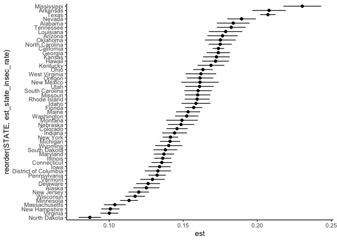

Geog 4/6300: Lab 4
================

## Confidence intervals and sampling

**Your name: {Nick Taborsak}**

**Overview:**

In this lab, we will be calculating estimated food insecurity at state
level. We will be using individual level “microdata” from the Current
Population Survey (CPS). It is designed as an ongoing (collected
monthly) set of data on financial and demographic characteristics. One
main use of the CPS is to calculate national levels of food insecurity.
Each December, a food security supplement is added to the regular
survey, and data from the supplement is included here.

To load these data, load the csv file, which is included in the lab
folder:

``` r
cps_data<-read_csv("data/IPUMS_CPS_FoodSec.csv")
```

This contains a csv file with microdata from the CPS that is
de-identified and publically available through the Minnesota Population
Center (<https://cps.ipums.org/cps/index.shtml>). There is also a
codebook that is part of the Github repo (IPUMS_CPS_CODEBOOK.pdf)
describing each of those variables.

\###Part 1: Calculating national food insecurity### For this lab, you
will be using the FSSTATUS variable, which describes the food security
of respondents. While food security status is often grouped into “low”
and “very low” food security, these two are often just combined to a
single measure: food insecure. The codebook (see the link above) lists
the values assocated with missing or “Not in universe” (NIU) records.
For the purposes of this lab, an additional column called FSSTATUS_cat
has been added with text versions of the FSSTATUS classification:
food_secure, low_fs, and “verylow_fs”.

**Question 1** *Filter out all records in this dataset that have missing
or NIU observations for food insecurity. Then use group_by and summarise
to calculate the number of individuals grouped in each food security
category (FSSTATUS). Call this table using kable. Based on these
results, calculate the estimated national food insecurity rate (those
rated 2 and 3).*

``` r
cps_food_insecurity<-cps_data %>%
  group_by(FSSTATUS) %>%
  count(FSSTATUS) %>%
  filter(FSSTATUS=="1" | FSSTATUS=="2" | FSSTATUS=="3") %>%
  mutate(est_natl_rate=65824/430757)
kable(cps_food_insecurity)
```

| FSSTATUS |      n | est_natl_rate |
|---------:|-------:|--------------:|
|        1 | 364933 |     0.1528101 |
|        2 |  43228 |     0.1528101 |
|        3 |  22596 |     0.1528101 |

**Question 2** *Using the formula for confidence intervals for
proportions shown in class, calculate a confidence interval for the rate
you identified in question 1. Make sure that confidence interval is
shown in the knitted document you create. Interpret what that confidence
interval tells you.*

``` r
p<-0.1528101
se<-sqrt((0.1528101*(1-0.1528101))/430757)
z.score<-qnorm(.975)
moe<-se*z.score
CI.lower<-p-moe
CI.upper<-p+moe
#CI = (0.151735620005333 - 0.153884579994667)
```

{This confidence interval suggests that we can be 95% confident that the
true estimated national food insecurity rate is between
0.151735620005333 (Lower-end CI) and 0.153884579994667 (Upper-end CI).}

### Part 2: Analyzing state food insecurity data

We can also use the “STATE” variable to calculate rates for each state.
You can adapt the code from question 1 above to include STATE as a
second grouping varirable.

\*\*Question 3\*\* *Create an estimated food insecurity rate for each
state from these data. To do so, you’ll need to create counts for each
response (food secure, low food security, very low food insecurity), and
transform the data so all three are spread out in wide format. You can
then sum the latter two variables and divide by the total responses
within each state. Call the head of your table when done using kable.*

``` r
cps_food_insecurity_state<-cps_data %>%
  group_by(FSSTATUS, STATE) %>%
  count(FSSTATUS, STATE) %>%
  filter(FSSTATUS=="1" | FSSTATUS=="2" | FSSTATUS=="3") %>%
  pivot_wider(names_from = FSSTATUS, values_from = n) %>%
  rowwise() %>%
  mutate(total = sum(across("1"|"2"|"3"), na.rm = T)) %>%
  mutate(total_food_insec = sum(across("2"|"3"), na.rm = T))%>%
  mutate(est_state_insec_rate = total_food_insec/total)
kable(head(cps_food_insecurity_state))
```

| STATE      |     1 |    2 |    3 | total | total_food_insec | est_state_insec_rate |
|:-----------|------:|-----:|-----:|------:|-----------------:|---------------------:|
| Alabama    |  3877 |  578 |  295 |  4750 |              873 |            0.1837895 |
| Alaska     |  4721 |  449 |  226 |  5396 |              675 |            0.1250927 |
| Arizona    |  4347 |  600 |  332 |  5279 |              932 |            0.1765486 |
| Arkansas   |  3927 |  675 |  356 |  4958 |             1031 |            0.2079468 |
| California | 30294 | 4318 | 2054 | 36666 |             6372 |            0.1737850 |
| Colorado   |  7984 |  872 |  491 |  9347 |             1363 |            0.1458222 |

**Question 4** *Calculate the error term (the standard error \* the z
score for 95% confidence) for each state. Call the head of your table
when done.*

``` r
cps_food_insecurity_state<-cps_food_insecurity_state %>%
  mutate(se=sqrt((est_state_insec_rate*(1-est_state_insec_rate))/(total))) %>%
  mutate(zscore=qnorm(.975)) %>%
  mutate(error_term=se*zscore) %>%
  mutate(ci_high=est_state_insec_rate+error_term,
         ci_low=est_state_insec_rate-error_term)
kable(head(cps_food_insecurity_state))
```

| STATE      |     1 |    2 |    3 | total | total_food_insec | est_state_insec_rate |        se |   zscore | error_term |   ci_high |    ci_low |
|:-----------|------:|-----:|-----:|------:|-----------------:|---------------------:|----------:|---------:|-----------:|----------:|----------:|
| Alabama    |  3877 |  578 |  295 |  4750 |              873 |            0.1837895 | 0.0056197 | 1.959964 |  0.0110144 | 0.1948039 | 0.1727750 |
| Alaska     |  4721 |  449 |  226 |  5396 |              675 |            0.1250927 | 0.0045036 | 1.959964 |  0.0088269 | 0.1339196 | 0.1162657 |
| Arizona    |  4347 |  600 |  332 |  5279 |              932 |            0.1765486 | 0.0052478 | 1.959964 |  0.0102855 | 0.1868340 | 0.1662631 |
| Arkansas   |  3927 |  675 |  356 |  4958 |             1031 |            0.2079468 | 0.0057637 | 1.959964 |  0.0112966 | 0.2192434 | 0.1966501 |
| California | 30294 | 4318 | 2054 | 36666 |             6372 |            0.1737850 | 0.0019789 | 1.959964 |  0.0038785 | 0.1776635 | 0.1699064 |
| Colorado   |  7984 |  872 |  491 |  9347 |             1363 |            0.1458222 | 0.0036505 | 1.959964 |  0.0071548 | 0.1529770 | 0.1386674 |

**Question 5** *Explain the purpose of each function you used in
question 4.*

{cps_food_insecurity_state\<-cps_food_insecurity_state %\>% - calls the
data frame to be used

mutate(se=sqrt((est_state_insec_rate\*(1-est_state_insec_rate))/(total)))
%\>% - creates a “standard error” variable, using it’s functional
equation to derive values

mutate(zscore=qnorm(.975)) %\>% - creates a “zscore” variable, and
derives value for 95% confidence interval

mutate(error_term=se\*zscore) - creates a “error_term” variable, and
calculates values by multiplying corresponding standard error and zscore
variable values

mutate(ci_high=est_state_insec_rate+error_term,
ci_low=est_state_insec_rate-error_term) - creates variables representing
high and low ends of confidence interval for each state. (needed for
question 6)

kable(head(cps_food_insecurity_state)) - calls the head of the resulting
data frame}

**Question 6** *Create a graph of the confidence intervals from question
4 using ggplot, geom_line (for the CI range), and geom_point (for the
estimated mean) as shown in class. Arrange the states along the y axis
based on the estimated food insecurity rate. See the code shared in
class lectures for a template to work from. (Bonus challenge: use one of
the options for geom_theme to change the look of this graph. Google it
or look at the documentation for more information.)*

``` r
cps_food_state_visual<-cps_food_insecurity_state %>%
  pivot_longer(c(ci_high,ci_low),
               names_to="ci",values_to="est")

ggplot(cps_food_state_visual) +
  geom_line(aes(x=est,y=reorder(STATE,est_state_insec_rate),group=STATE))+
  geom_point(aes(x=est_state_insec_rate,y=STATE))+
  theme_classic()
```

<!-- -->

**Question 7** *Compare the margin of error (error term) you calculated
for Georgia to the national margin of error. How do they differ?
Mathematically, why are they different?*

{National MoE: 0.00107447999466694 GA MoE: 0.007841830 GA’s MoE is far
larger than that of the nation as a whole. Mathematically, they’re
different because the national MoE has a much larger sample size than
the state of Georgia. Larger sample sizes yield narrower CI’s and
smaller MoE’s.}

**Question 8** *Create a column in your state food insecurity estimates
that converts each state’s food insecurity rate to a z score based on
all 50 states’ rates. What is the z score for New Jersey? What does that
z score tell you?*

``` r
sd(cps_food_insecurity_state$est_state_insec_rate, na.rm = FALSE)
```

    ## [1] 0.02856179

``` r
cps_food_insecurity_state<-cps_food_insecurity_state %>%
  mutate(zscore_state=(est_state_insec_rate-0.1528101)/0.02856179)
```

{NJ z score: -1.14941652; this tells me that NJ’s estimated food
insecurity rate is 1.14941652 standard deviations lower than the
estimated national food insecurity rate. This makes sense, as NJ has the
7th lowest estimated food insecurity rate by state. }

**Bonus challenge** The lab data folder includes two additional files:
\* A geotiff raster showing proximity (in unspecified units) to
SNAP-authorized supermarkets in the Atlanta metro:
atl_snapsupers_proxmity.tig \* A polygon layer of census tracts in the
core Atlanta metro along with their population: atl_tracts.gpkg \* A
point layer of park spaces listed on OpenStreetMap: atl_osm_parks

Using the techniques discussed in the scripts on spatial operations and
raster analysis, map out the census tracts and/or parks located in areas
with the lowest proximity (highest values on the raster) to
supermarkets. Make sure your map(s) is visible in the output and clearly
show the tracts/parks where new food options could be improve the
proximity of healthy foods. Provide an interpretation of your map(s)
that explains what patterns they show.

``` r
#Code goes here
```

(Your interpretation here)

**Lab reflection:** *How do you feel about the work you did on this lab?
Was it easy, moderate, or hard? What were the biggest things you learned
by completing it?*

{I feel pretty good about the work I did on this lab. I’d say that
compared to previous labs, this one was a bit easier and less strenuous.
Having the extra time to submit this lab really helped out a lot, so I
feel like that made this lab a lot more manageable for me personally.
The biggest things I learned while completing this lab were how to
interpret different statistical values, such as z-scores and margins of
error, and their applicability in deriving confidence intervals. It felt
good to get some repetitions in, regarding working with statistical
analyses and constucting CI’s.}
